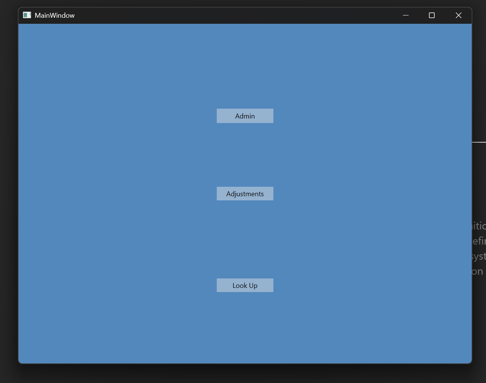
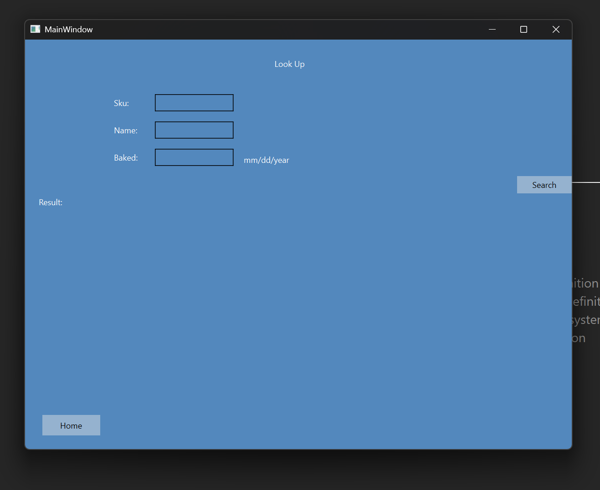
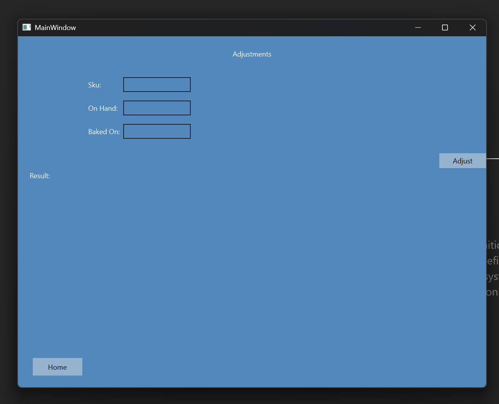
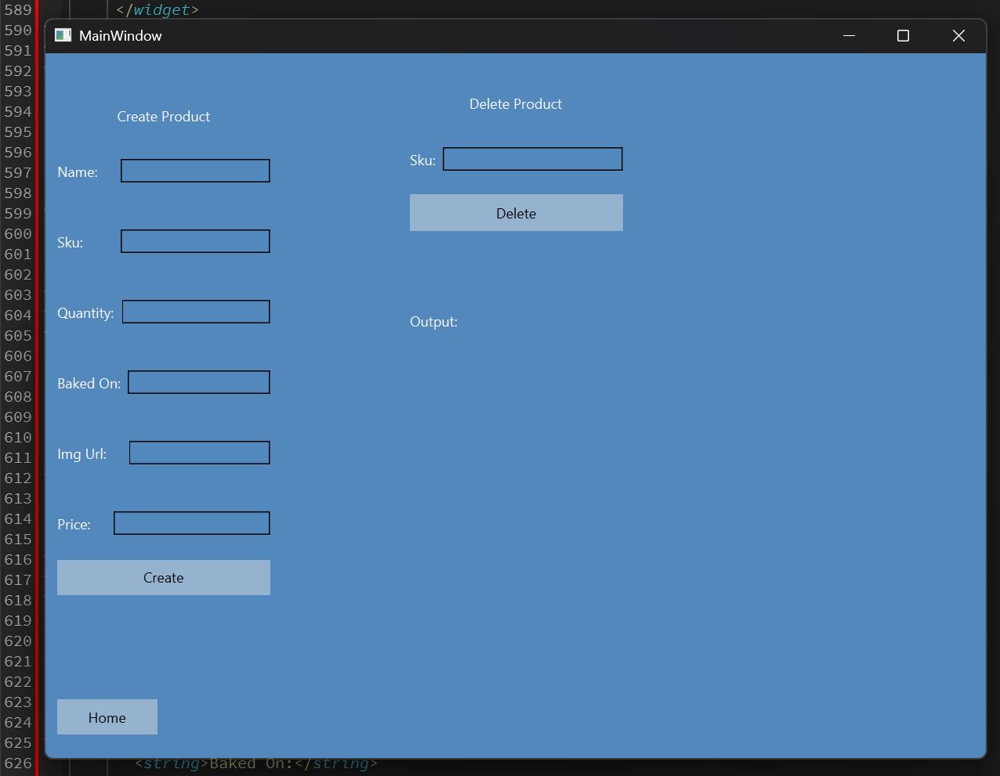

# Inventory Manager Application

A modern c++/Qt desktop application for managing product inventory with,
Full CRUD operations, real time API communication, and a clean responsive UI layout

This project demonstrates professional C++ development using Qts networking, json handling, and UI framework.

## Features

- Create, Read, Update, Delete product entries
- Rest API integration using QNetworkAccessManager
- Sku based product identification
- Json serialization/deserialization
- Dynamic UI updates
- Error handling network requests
- Qt Designer built UI
- Cross platform desktop support

## Screenshots





## Technical skill

- C++17
- Qt 6
- Qt network modules
- MongoDB / Express backend with Node.js
- CMake

## Project structure

QtInventoryManager/
    Src/
        main.cpp
        mainwindow.cpp
    Header/
        mainwindow.h
    Forms/
        mainwindow.ui
    CMakeList.txt
    README.md
    LICENSE

## API Endpoints

### GET all products
GET /products

### POST create product
POST /products
Required json input

### PATCH update product by sku
PATCH /products/:sku

### DELETE product by sku
Delete /products/:sku

## Building the application

```bash
# Create a build directory
mkdir build
cd build

# Configure the project with CMake, cmake and a C++ compiler must be installed for this command to work
cmake ..

# Build the application
cmake build

# Run the executable
./QtInventoryManager
```

## Future Improvements

Product search bar in other pages than just the look up page

CSV export/import

Authentication for API access

## This project is licensed under the MIT License

## Author
Michael Jones

Independent Multi Language Software Developer

    

